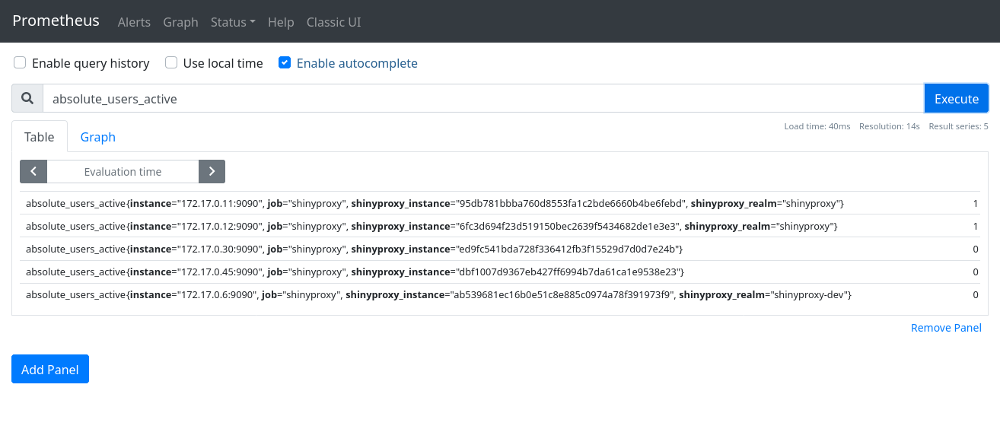
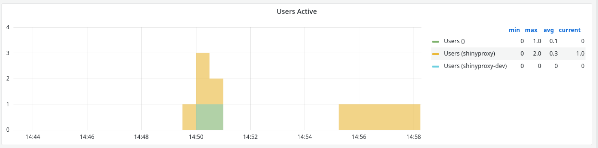

# Prometheus Usage Statistics

This page describes how the usage statistics feature of ShinyProxy works in
combination with the operator.

**Note:** this page is only applicable to ShinyProxy 2.6.0.

Before diving into the details, have a look at the setup of Prometheus
monitoring with ShinyProxy in a [regular deployment](https://shinyproxy.io/documentation/usage-statistics/#micrometer).

Because the operator is meant to dynamically create ShinyProxy servers, it does
not suffice to configure static list of ShinyProxy servers in Prometheus.
Fortunately, Prometheus has the concept of [Service Discover](https://prometheus.io/docs/prometheus/latest/configuration/configuration/),
which allows Prometheus to automatically *discover* ShinyProxy servers. We
assume here that Prometheus is running in the same Kubernetes cluster as the
ShinyProxy operator.

What follows is an example configuration of Prometheus:

```yaml
scrape_configs:
  - job_name: 'k8pods'
    kubernetes_sd_configs:
    - role: pod
    relabel_configs:
    - source_labels: [__meta_kubernetes_pod_container_port_name]
      regex: metrics
      action: keep
    - source_labels: [__meta_kubernetes_pod_container_name]
      target_label: job
  - job_name: 'shinyproxy'
    metrics_path: '/actuator/prometheus'
    kubernetes_sd_configs:
    - role: pod
    relabel_configs:
    # instruct Prometheus to only look for ShinyProxy servers
    - source_labels: [__meta_kubernetes_pod_label_app]
      regex: shinyproxy
      action: keep
    # instruct Prometheus to use the special actuator port (9090)
    - source_labels: [__meta_kubernetes_pod_container_port_name]
      regex: actuator
      action: keep
    # provide a value for the job label
    - source_labels: [__meta_kubernetes_pod_container_name]
      target_label: job
```

This configuration automatically discovers all ShinyProxy servers.



The above screenshot shows the `absolute_users_active` metric int the Prometheus
UI. The `shinyproxy_realm` label is automatically added by ShinyProxy to every
metric. The tag contains the resource name of the ShinyProxy server. Therefore
this tag is not added to the metrics when ShinyProxy is not being run using the
Operator. In the screenshot there are three ShinyProxy servers being managed by
the ShinyProxy server and two servers using a traditional deployment. The
`shinyproxy` realm has has two severs (instances) running (see the
`shinyproxy_instance` label). The dashboard provided on the [ShinyProxy website](https://shinyproxy.io/documentation/usage-statistics/#micrometer) 
is designed to work with multiple realms and multiple servers inside each realm.
For example, when displaying the Active Users, the dashboard differentiates
between the different realms:



The dashboard contains two variables which allow you to filter the panels by
realm or app name. By default these are hidden, check the [ShinyProxy website](https://shinyproxy.io/documentation/usage-statistics/#variable-filters)
to makes these visible.
